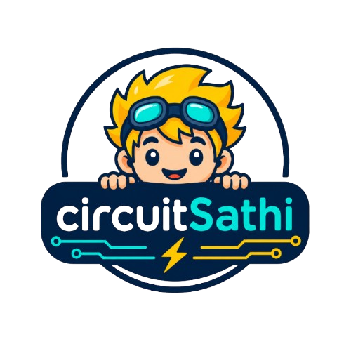
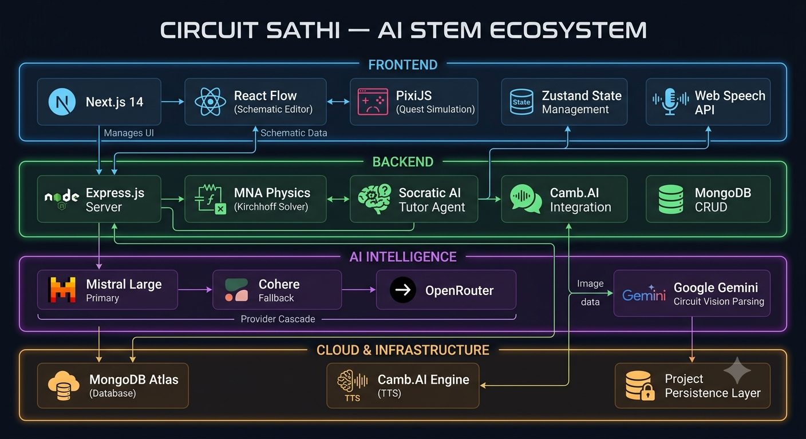

<div align="center">
  
  <h1>Circuit Sathi ⚡</h1>
  <h3>AI × STEM Education — DSH Hacks V1 Submission</h3>
  <p>Reimagining Physics and Electronics education through interactive gamification and AI-driven tutoring.</p>

  <br/>

  
  
  
  
  
  
</div>

---

## 💡 The Problem

In traditional STEM education, electronics and physics are often taught purely theoretically. Students memorize formulas like `V = IR` but struggle to visualize the *flow* of electrons or understand real-world application. The learning curve is steep, and the subject is frequently perceived as boring, abstract, and intimidating.

## 🚀 The Solution: Circuit Sathi

**Circuit Sathi** bridges the gap between theoretical circuit design and practical, gamified physics simulation.
Built specifically for **DSH Hacks V1**, it provides an integrated platform where students can visually build circuits, watch electrons flow through RPG-style quest environments, and interact with an intelligent Socratic AI Tutor to learn core concepts interactively.

### 🌟 Key Features

| Feature | Description |
|---|---|
| 🎮 **Gamified Circuit Simulation** | Watch an "Electron Traveler" traverse circuit paths in real-time across themed biomes (Forest, Arctic, Desert, Lava, Void) — each representing circuit states like normal flow, short circuits, and overloads. |
| 🔧 **Interactive Schematic Builder** | Drag, drop, and wire 25+ electronic components (Batteries, Resistors, LEDs, Capacitors, Transistors, Logic Gates, ...) in a smooth, React Flow-powered lab interface. |
| 🧠 **Socratic AI Tutor** | An embedded agentic AI tutor that doesn't just give answers but **guides students to understand _why_** their circuit behaves a certain way. Uses tool-calling loops to generate structured tutorials with step-by-step learning paths. |
| 📄 **Smart Lab Upload** | Upload lab manuals (PDF/DOCX) or circuit images — the AI parses them into interactive schematics. Supports **KiCad**, **SPICE/LTspice**, and **CDDX** netlist formats natively. |
| 🔊 **Camb.AI Voice Narration** | High-quality immersive voice narration powered by **Camb.AI** TTS engine (`mars-8.1-flash-beta`), providing audio explanations of circuit behavior. |
| 🎙️ **Voice Q&A Agent** | Real-time voice interaction using Web Speech API for speech recognition + Camb.AI TTS for spoken responses, with live circuit context awareness. |
| 📐 **Real Physics Engine** | Dual simulation: client-side BFS-based analysis for instant feedback + server-side **Modified Nodal Analysis (MNA)** with Gaussian elimination for accurate V/I/R/P calculations. |
| 💾 **Project Persistence** | Save, load, and revisit circuit experiments via MongoDB-backed API with full CRUD support. |
| 🏆 **XP & Progression System** | Level up through 5 curriculum stages (Ohm's Law → Kirchhoff's Legacy) with mission-based challenges, XP rewards, and biome unlocks. |

---

## 🏗️ Software Architecture

<div align="center">
  
</div>

### Architecture Highlights

- **Frontend Layer:** A Next.js 14 monorepo leveraging `reactflow` for interactive node-based wiring and schematic building, while `pixi.js` v8 powers heavy-duty 2D WebGL rendering of traveling electrons across themed biomes. Global state is centralized in `Zustand`. Client-side simulation provides instant feedback using BFS connectivity analysis.

- **Backend / AI Integration:** Express.js 5 APIs handle six route families (`health`, `projects`, `simulate`, `upload`, `narrate`, `tutor`). The tutor integrates with a **multi-provider AI cascade**: Mistral Large (primary) → Cohere Command-R+ (fallback) → OpenRouter (final fallback), all via OpenAI-compatible SDK. The tutor uses an **agentic tool-calling loop** (up to 5 rounds) with structured `generate_tutorial` function calls to produce step-by-step lessons with circuit schematics.

- **Physics Solver:** Server-side **Modified Nodal Analysis (MNA)** with Union-Find net collapsing and Gaussian elimination solves for accurate node voltages and branch currents. Stamps resistors, voltage sources, and LED models (2V drop + 100Ω internal resistance).

- **Vision Pipeline:** The upload route accepts circuit images (PNG/JPG/WebP) and uses **Google Gemini Flash** (with automatic model fallback: `2.5-flash` → `2.0-flash` → `1.5-flash`) to parse visual schematics into structured `CircuitGraph` JSON. Also natively parses **KiCad** (`.kicad_sch`), **SPICE** (`.asc`, `.cir`, `.net`), and **CDDX XML** formats.

- **Voice System:** Fully powered by **Camb.AI TTS** (`mars-8.1-flash-beta`) for narration of simulation results and tutorial steps. Voice Q&A uses the browser's **Web Speech API** for speech-to-text, sends the query to the AI tutor backend, and speaks the response via Camb.AI — no third-party voice agent dependency.

- **Data Persistence:** Circuit projects (graph + scene config) are stored in MongoDB via Mongoose ODM with full CRUD operations.

---

## 🧩 Tech Stack

| Layer | Technology | Purpose |
|---|---|---|
| **Frontend** | Next.js 14, React 18, TypeScript | App framework & UI |
| **State** | Zustand 5 | Centralized client state |
| **Schematic** | React Flow 11 | Node-based circuit editor |
| **Rendering** | PixiJS 8 (WebGL) | Gamified quest world simulation |
| **Styling** | TailwindCSS 3 | Utility-first CSS |
| **Backend** | Express.js 5, TypeScript | REST API server |
| **Database** | MongoDB Atlas + Mongoose 9 | Project persistence |
| **Primary LLM** | Mistral Large (`mistral-large-latest`) | Tutor chat & simulation commentary |
| **Fallback LLM** | Cohere Command-R+ (`command-r-plus-08-2024`) | Secondary AI fallback |
| **Final Fallback** | OpenRouter (`openrouter/auto`) | Tertiary AI fallback |
| **Vision AI** | Google Gemini Flash (2.5/2.0/1.5) | Circuit image → schematic parsing |
| **TTS** | Camb.AI (`mars-8.1-flash-beta`) | Voice narration |
| **Voice Input** | Web Speech API (browser-native) | Speech-to-text for voice Q&A |
| **File Parsing** | pdf-parse, mammoth | PDF/DOCX lab manual extraction |

---

## 🛠️ Quick Setup Guide

### Prerequisites
- Node.js 18+
- npm 9+
- MongoDB connection string (Atlas or local)

### 1. Clone & Install

```bash
git clone https://github.com/your-username/CircuitSathi.git
cd CircuitSathi
npm install
```

### 2. Configure Environment

```bash
cd backend
cp .env.example .env
```

Update `.env` with your API keys:

| Variable | Required | Description |
|---|---|---|
| `PORT` | ✅ | Backend port (default: `3001`) |
| `MONGODB_URI` | ✅ | MongoDB connection string |
| `MISTRAL_API_KEY` | ✅ | Primary LLM for tutor & simulation |
| `COHERE_API_KEY` | ⬜ | Fallback LLM (optional) |
| `OPENROUTER_API_KEY` | ⬜ | Final fallback LLM (optional) |
| `CAMBAI_API_KEY` | ✅ | Camb.AI TTS for voice narration |

### 3. Start Development

**Option A — One-click launch:**
```bash
chmod +x start.sh
./start.sh
```

**Option B — Manual:**
```bash
# Terminal 1: Backend
cd backend && npm run dev

# Terminal 2: Frontend
cd frontend && npm run dev
```

| Service | URL |
|---|---|
| Frontend | `http://localhost:3000` |
| Backend API | `http://localhost:3001` |

---

## 📁 Repository Structure

```text
CircuitSathi/
├── backend/                    # Express.js API Server
│   ├── index.ts                # Server entry — CORS, routes, MongoDB connection
│   ├── lib/
│   │   └── ai.ts               # Multi-provider AI client (Mistral → Cohere → OpenRouter)
│   │                           # + Camb.AI TTS integration + Agentic tool-calling loop
│   ├── routes/
│   │   ├── simulate.ts         # MNA physics solver (Union-Find + Gaussian elimination)
│   │   ├── tutor.ts            # Socratic AI tutor (tool-calling + JSON fallback)
│   │   ├── upload.ts           # Multi-format parser (Gemini Vision, KiCad, SPICE, CDDX)
│   │   ├── narrate.ts          # Camb.AI TTS narration endpoint
│   │   ├── projects.ts         # MongoDB CRUD for circuit projects
│   │   └── health.ts           # Health check endpoint
│   ├── models/                 # Mongoose schemas (CircuitProject)
│   ├── scripts/                # Standalone test scripts
│   └── .env.example            # Environment template
│
├── frontend/                   # Next.js 14 Client Application
│   ├── app/
│   │   ├── layout.tsx          # Root layout (Press Start 2P + VT323 fonts)
│   │   └── page.tsx            # Main split-screen workspace + onboarding
│   ├── components/
│   │   ├── SchematicBuilder.tsx # React Flow circuit editor (drag-drop, wiring)
│   │   ├── QuestView.tsx       # PixiJS gamified quest world (biomes, electron travel)
│   │   ├── TutorPanel.tsx      # AI tutor interface (chat, tutorials, voice)
│   │   ├── VoiceAgent.tsx      # Voice Agent (Web Speech API + Camb.AI TTS)
│   │   ├── BuildCanvas.tsx     # Extended canvas with drawing tools
│   │   ├── ComponentPalette.tsx# Drag-and-drop component library (25+ parts)
│   │   ├── CanvasToolbar.tsx   # Toolbar with simulation controls
│   │   ├── TopNav.tsx          # Navigation bar with mode switching
│   │   ├── ExplanationPanel.tsx# Circuit analysis explanation display
│   │   ├── UploadZone.tsx      # File upload UI (PDF, DOCX, Images, KiCad, SPICE)
│   │   └── CityView.tsx        # City-themed circuit visualization
│   ├── store/
│   │   └── circuitStore.ts     # Zustand store (circuit state, XP, tutorials)
│   └── lib/
│       ├── simulationEngine.ts # Client-side BFS circuit solver
│       ├── levels.ts           # 5-level curriculum (Ohm → Kirchhoff)
│       ├── demoCircuits.ts     # Pre-built demo circuits
│       ├── debugPresets.ts     # Debug circuit configurations
│       ├── api.ts              # Backend API client functions
│       ├── parsers/            # Frontend-side KiCad/SPICE/CDDX parsers
│       └── reactflow/          # Custom React Flow node types
│
├── shared/                     # Shared TypeScript types (full-stack type safety)
│   ├── types.ts                # CircuitComponent, SimulationState, TutorialStep
│   └── types/
│       └── circuit.ts          # CircuitNode, CircuitEdge, SceneConfig
│
├── docs/                       # Documentation & assets
│   ├── assets/                 # Logo, architecture diagram
│   └── circuits-as-a-quest-README.docx.md
│
├── package.json                # Root monorepo config (npm workspaces)
├── start.sh                    # One-click dev launch script
└── README.md                   # You are here!
```

---

## 🎓 Learning Curriculum

Circuit Sathi features a progressive **5-level electronics curriculum** with themed biomes:

| Level | Name | Biome | Concepts | XP Unlock |
|---|---|---|---|---|
| 1 | Ohm's Law | 🌲 Forest | Voltage, Resistance, Current | 0 |
| 2 | Series Circuits | ❄️ Arctic | Series Resistance, Voltage Division | 300 |
| 3 | Parallel Circuits | 🏜️ Desert | Parallel Resistance, Current Splitting | 1,000 |
| 4 | Energy Storage | 🏰 Dungeon | Capacitance, RC Time Constant | 2,500 |
| 5 | Kirchhoff's Legacy | 🔮 Void | KCL, KVL, Complex Nodes | 6,000 |

Each level contains missions with real-time validation logic that checks if the student's circuit satisfies the physics requirements.

---

## 🔌 API Endpoints

| Method | Endpoint | Description |
|---|---|---|
| `GET` | `/api/health` | Server health check |
| `GET` | `/api/projects` | List all saved projects |
| `POST` | `/api/projects` | Create a new project |
| `GET` | `/api/projects/:id` | Get a project by ID |
| `DELETE` | `/api/projects/:id` | Delete a project |
| `POST` | `/api/simulate` | Run MNA simulation on a circuit graph |
| `POST` | `/api/tutor/parse` | Parse a topic/manual and generate AI tutorial |
| `POST` | `/api/narrate` | Generate TTS audio from text (Camb.AI) |
| `POST` | `/api/upload` | Upload circuit file/image for parsing |

---

## 🤖 AI Integration Deep Dive

### Multi-Provider Cascade
The AI system uses a **graceful degradation strategy** with automatic failover:

```
Mistral Large (primary) → Cohere Command-R+ (secondary) → OpenRouter Auto (tertiary)
```

All providers are accessed through the OpenAI-compatible SDK, making the entire cascade transparent to the application logic.

### Agentic Tutor
The tutor uses a **multi-round tool-calling loop** (up to 5 rounds) where the LLM invokes a `generate_tutorial` function that returns:
- Structured learning steps with explanations
- Complete circuit schematics (components + edges)
- Bilingual responses (English / Urdu detection)

If the agentic loop fails, it falls back to a simpler **structured JSON prompt** for maximum reliability.

### Vision Parser
Circuit images are processed by **Google Gemini Flash** with automatic model cascading (`2.5-flash` → `2.0-flash` → `1.5-flash`). The vision model extracts component types, values, and positions from hand-drawn or printed schematics.

---

<div align="center">
  <i>Built with ❤️ for DSH Hacks V1. Innovating the future of STEM.</i>
</div>
